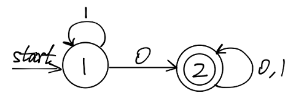

# DFA2RE
convert DFA to regular expression

## How to use
```bash
python3 dfa2re.py [-v] [--method=<method>] [--dfa=<dfa-filename>] [--new] [--cache=<path-to-store-dfa>] 
```

Use `python3 dfa2re.py --help` to see details of the options.

## Example
 

Run
```bash
python3 dfa2re.py --new
```
Then, input the above DFA:
```
#states: 2
src dst value (input "EOF" to break):
1 1 1
src dst value (input "EOF" to break):
1 2 0
src dst value (input "EOF" to break):
2 2 0
src dst value (input "EOF" to break):
2 2 1
src dst value (input "EOF" to break):
EOF
name of start state: 1
list of accept states: (separated by white space)
2
```

The program will output the matrix:
```
1* 1*0(0|1)* 
None (0|1)* 
```
and the regex answer:
```
1*0(0|1)*
```
